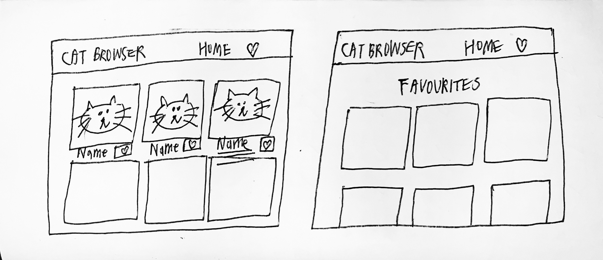

# Cat Browser

A full-stack MERN web application that allows users to browse cat images and save to a favourites list. A user can like an image when browsing, view all the liked images and delete an image from the Favourites page.

## Demo


## To install and run the code

- Clone the repo
- Run `$ npm install`
- Run `$ npm run client-install`
- Run `$ touch .env` and copy your API key 
- Run `$ echo "API_KEY=YOUR_KEY” >> .env` replace YOUR_KEY
- Run `$ npm run dev` to start both servers


## To run the test

- Run `$ npm test` for the Express endpoint tests
- Run `$ cd client && npm test` for the React tests

## Features
- User can browse cat pictures on the home page
- User can like an image and save to favourites list
- User can visit the Favourites page
- User can view all the liked images
- User can delete an image from favourites list

## Technologies used
- Javascript
- React
- Node.js
- Express
- MongoDB
- Mongoose
- Jest
- Enzyme

### External Cat API
- Get your API Key from - https://thecatapi.com/

### Tools
- Axios
- React Router
- Body parser
- Nodemon
- Bootstrap

## How to design the solution

- Layout sketch


- Backend
  - Start off the backend using Node, Express and MongoDB to create an API so the frontend can communicate with the database
  - Create the model `Favourite` connecting with  MongoDB. The app only stores favourite cat pictures to the database
  - Use schema-based solution Mongoose to model application data
  - Set up routes for the API

- Frontend
  - Create a navbar, add `Home`, `Favourites` components and link the routes
  - Extract `Navbar` to a separate component, to keep `app.js` simple and structured
  - Add `Pictures` as a child component of `Home` component
  - Fetch pictures from Cat API and display on home page
  - Add `Like` button for each picture, clicking on it should store to the database by calling express API <POST>
  - Add `Load More` button to limit the visible pics
  - To know whether liked or not, it renders a filled heart icon after click on `Like`
  - Create `FavouritesList` as a child component of `Favourites` component
  - Fetch liked data by calling express API <DELETE> and show on the fevourites page
  - Add image highlight when target is on mouse
  - Click on `Delete` button should remove it from the database by calling express API <DELETE>

## User stories
```
As a user
So I can browse cat pictures
I want to see the cat pictures on the page

As a user
So I can see a cat clearly 
I want to be able to click on a cat

As a user
So I can what picture I like
I want to be able to store a cat to my favourites

As a user
So I can come back to my favourites list
I want to be able to see all my favourites on a page

As a user
So I can change my mind about a picture
I want to be able to delete a picture 
```


## Progress Report

Jest 
- Preset with MongoDB: MongoDB memory server allows to store your data in memory only

To fix dependency issue
1. Delete package-lock.json
2. Delete node-modules
3. Add the right dependencies version or delete the dependency in package.json
4. Run `$ npm install`

To solve MongoDB connection error
- Type: MongoTimeoutError
- Issue: It gives out new IPs everytime (DHCP) when I reconnect to the network, but Mongo Atlas only white lists the previously specified IP address
- Solution: Check if the IP address specified correctly in the Network Access tab
- Security -> Network Access -> IP Whitelist 

CSS Flexbox
- A useful layout model that allows elements to align and distribute space within a container
- Learn more: https://www.youtube.com/watch?v=JJSoEo8JSnc

Axios
- `delete` requests with a body need it to be set under a `data` key
